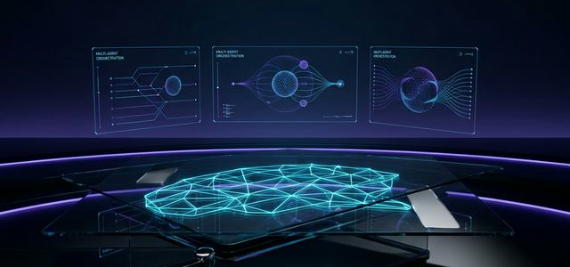

  

<h1 align="center">Hi there, I'm Manoj Mallick 👋</h1>
<h3 align="center">Architecting the Future with AI & Code</h3>

  

  
  
  
  

---

## 👨‍💻 About Me

I am a **Professional Full Stack Developer** with over **15 years** of hands-on experience in software engineering, system design, and artificial intelligence. I’ve worked across frontend, backend, DevOps, and AI, building enterprise-grade systems for real-world applications — from large-scale microservices to cognitive AI platforms.

I’m passionate about **teaching the real, modern way of coding** — combining deep technical foundations with today’s most advanced technologies: **Generative AI, Agentic systems, RAG architectures, cloud automation, and intelligent DevOps**.

Whether you are a beginner exploring your first “Hello World,” a professional improving your stack, or a researcher/developer exploring AI systems, I guide you step-by-step — conceptually, practically, and strategically.

---

## 💼 Professional Experience

| Role | Company | Duration |
| :--- | :--- | :--- |
| **Gen AI Specialist & Senior Full Stack Engineer** |  | *Nov 2022 - Present* |
| **Gen AI Specialist & Senior Technical Lead** |  | *Nov 2020 - Present* |
| **Senior Full Stack Engineer** |  | *Oct 2019 - Nov 2020* |
| **Senior Software Development Engineer** |  | *Jan 2017 - Sep 2019* |
| **Technical Lead / Senior Developer** |  | *Jul 2014 - May 2017* |
| **Software Developer** |  | *Oct 2011 - Oct 2019* |

---

## 🚀 The Arsenal (Tech Stack)

### 🧩 Front-End Development

### ⚙️ Back-End & Enterprise

### ☁️ Cloud & DevOps

### 🤖 AI, ML & Generative AI

### 🔬 Data & Databases

---

## � GitHub Stats

  <table>
    <tr>
      <td align="center" width="50%">
        
      </td>
      <td align="center" width="50%">
        
      </td>
    </tr>
    <tr>
      <td align="center" colspan="2">
        
      </td>
    </tr>
  </table>

---

## 🤝 Connect & Collaborate

I am always open to discussing new projects, creative ideas, or opportunities to be part of your visions.

  
  
  

Made with ❤️ and AI by Manoj Mallick

